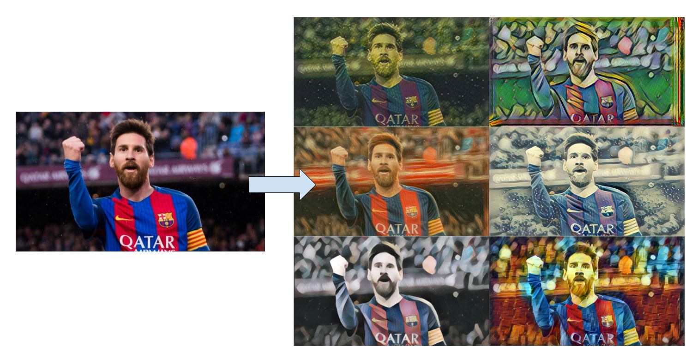

# Fast Style Transfer


> Add styles from famous paintings to any photo!
> **This work is just an example demonstration from [lengstrom/fast-style-transfer](https://github.com/lengstrom/fast-style-transfer) amazing work**



## [Link to model](https://github.com/iitzco/deepzoo/releases/download/model-upload-8/fast_style_transfer_models.zip)

## Requirements

Run `pip install -r requirements.txt`

This will install `numpy`, `opencv` and `tensorflow`, which are it's only dependencies.

## How to run

Use `PainterNetwork` class from `painter.py`. 

The class can be used as shown in the following example:

```python
from painter import PainterNetwork
import cv2
import sys
import numpy as np


# Pick one of the 6 available style models
MODEL_PATH = "/path/to/style/model"

IMG_PATH = "/path/to/image"

# Read image into [0-255] numpy array
img = cv2.imread(IMG_PATH)

# Remember openCV works in BGR
img = cv2.cvtColor(img, cv2.COLOR_BGR2RGB)

# `run` method receives [0-255] RGB image array and model path
# returns [0-255] RGB image array.
img = PainterNetwork.run(img, MODEL_PATH) # Receives 

# Remember openCV works in BGR
img = cv2.cvtColor(img, cv2.COLOR_RGB2BGR)

# Display image
cv2.imshow('image', img)
cv2.waitKey(0)
cv2.destroyAllWindows()

# Save image
cv2.imwrite("output.png", img)
```

## How to use other styles?

You will need to go to the original repo [lengstrom/fast-style-transfer](https://github.com/lengstrom/fast-style-transfer) to create new networks with your own styles. Once you got your new `.ckpt` file, you can come back to these snippets to run it.

## Model info

Models were found in [lengstrom/fast-style-transfer](https://github.com/lengstrom/fast-style-transfer).

