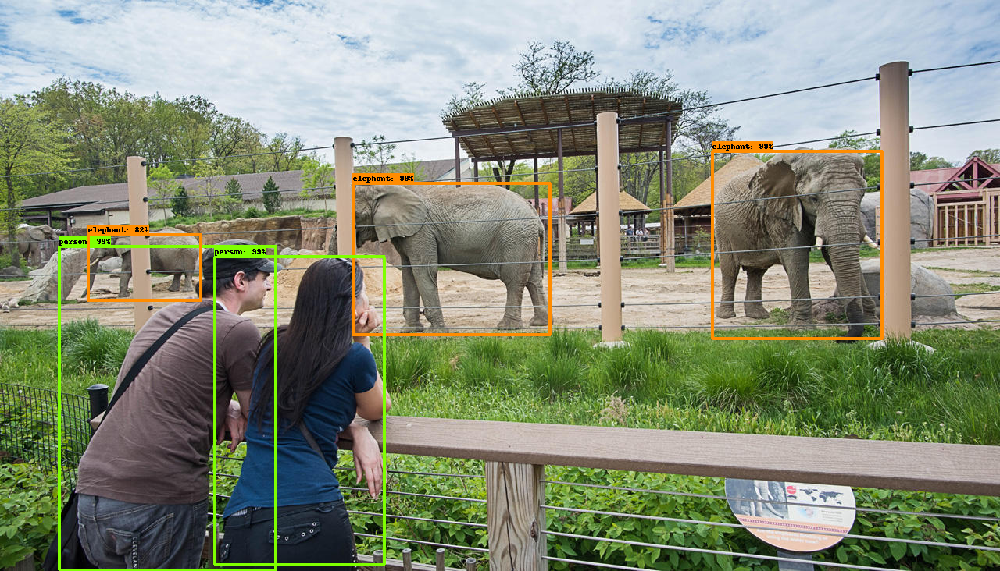

# FasterRCNN Resnet 50 trained on COCO



> Locate and classify all objects that are present in an image

## [Link to model]()

## Requirements

* tensorflow
* numpy

Install them by running `pip install -r requirements.txt`

## How to run

Use `ObjectDetector` class from `detector.py`. 

The class can be used as shown in the following example:

```python
img_path = "/path/to/my/image"
img = np.asarray(Image.open(img_path), dtype=np.uint8)

# Provide the .pb model file path
graph_path = "/path/to/downloaded/model"

model = ObjectDetector(graph_path)
out = model.run(img)

print(out)
```

> *NOTE*: the `run` method receives a numpy array with shape [H, W, C]. If you use the Image library to open the image, remember to also install `pillow`.

Example output:

```json
{  
   "objects":[  
      {  
         "x0":0.3526,
         "y0":0.3221,
         "x1":0.5507,
         "y1":0.5852,
         "object":"elephant",
         "probability":0.9997
      },
      {  
         "x0":0.7122,
         "y0":0.2654,
         "x1":0.8825,
         "y1":0.5921,
         "object":"elephant",
         "probability":0.9996
      },
      {  
         "x0":0.0593,
         "y0":0.433,
         "x1":0.2758,
         "y1":0.998,
         "object":"person",
         "probability":0.9987
      },
      {  
         "x0":0.2146,
         "y0":0.4503,
         "x1":0.3851,
         "y1":0.9879,
         "object":"person",
         "probability":0.997
      },
    ...
   ]
}
```

## Customize

If the json format does not suit your needs, just implement other handlers!

## Model info

Provided by tensorflow in it's model zoo. Link [here](https://github.com/tensorflow/models/blob/master/research/object_detection/g3doc/detection_model_zoo.md)
