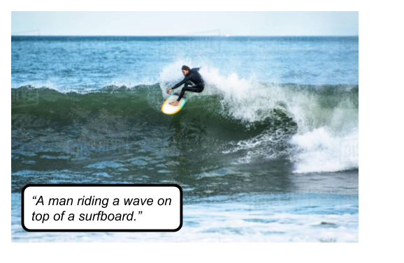

# im2txt: Show and Tell implementation

> Caption an image

* Work from [tensorflow official implementation](https://github.com/tensorflow/models/tree/master/research/im2txt)



## [Link to model](https://github.com/iitzco/deepzoo/releases/download/model-upload-10/im2txt_models.zip)

## Requirements

Run `pip install -r requirements.txt`

This will install `tensorflow` and `numpy`, which are it's only dependencies.

## How to run

You will need to use `im2txt` module found in this repo.

Use `Im2Txt` class from `im2txt/im2txt.py`. 

The class can be used as shown in the following example:

```python
from im2txt.im2txt import Im2Txt


CHECKPOINT_PATH = "path/to/downloaded/model/folder"
VOCAB_FILE = "path/to/downloaded/word_count.txt"
IMAGE_PATH = "path/to/image"


model = Im2Txt(CHECKPOINT_PATH, VOCAB_FILE)
captions = model.run(IMAGE_PATH)

for p, sentence in captions:
    print("{} (p={})".format(sentence, p))
```

## Some results

| "a man riding on the back of a brown horse" |    "a large jetliner flying through a cloudy sky"           |
| ------------- |:-------------:|
|    |  |

## Model info

Model was found [here](https://github.com/tensorflow/models/issues/466). It's a community-made model because there was no official trained model.
Model was modified to be compatible with tensorflow>1.7 versions.

