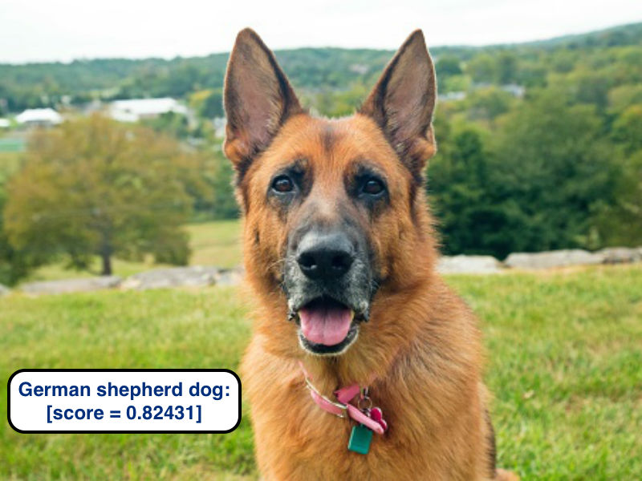

# Inception trained on ImageNet

> Classify images in ~1000 classes



## [Link to model](https://github.com/iitzco/deepzoo/releases/download/model-upload-3/inception-2015-12-05.zip)

## Requirements

* tensorflow
* numpy

Install them by running `pip install -r requirements.txt`

## How to run

Use `ObjectDetector` class from `detector.py`. 

The class can be used as shown in the following example:

```python
img_path = "/path/to/my/image"

# Provide the .pb model file path
graph_path = "/path/to/downloaded/model"

# Provide the json label map file path
label_map = "/path/to/json/label/map"

model = Classifier(graph_path, label_map)
out = model.run(img_path)

print(out)
```

> *NOTE*: the `run` method receives an img path.

Example output:

```
{
 'German shepherd': 0.82430726,
 'briard': 0.0030906952,
 'groenendael': 0.0024705573,
 'kelpie': 0.0021895107,
 'malinois': 0.040284574
}
```

## Model info

Provided by tensorflow in it's tutorial section. Link [here](https://github.com/tensorflow/models/tree/master/tutorials/image/imagenet)
