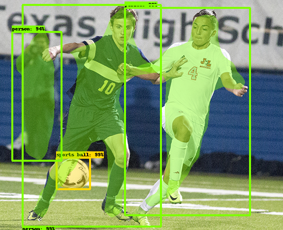

# MaskRCNN Inception trained on COCO



<p align="left">
  <a href="https://github.com/iitzco/deepzoo/releases/download/model-upload-2/mask_rcnn_inception_v2_coco_2018_01_28.zip">
    
  </a>
</p>

## Requirements

* tensorflow
* numpy
* matplotlib

Install them by running `pip install -r requirements.txt`

## How to run

Use `MaskRCNNModel` class from `maskrcnn.py`. 

The class can be used as shown in the following example:

```python
img_path = "/path/to/my/image"

# Provide the .pb model file path
graph_path = "/path/to/downloaded/pbmodel"

# Provide the .pbtxt label map file path
label_map = "/path/to/downloaded/pbmap"

model = MaskRCNNModel(graph_path, label_map)

out = model.run(img)
img = Image.fromarray(out)
img.show()
```

> *NOTE*: the `run` method receives a numpy array with shape [H, W, C]. If you use the Image library to open the image, remember to also install `pillow`.

An image with the intance segmentation should show up.

## Customize

See `json_handler` to see how to handle the model's output.

## Model info

Provided by tensorflow in it's model zoo. Link [here](https://github.com/tensorflow/models/blob/master/research/object_detection/g3doc/detection_model_zoo.md)
