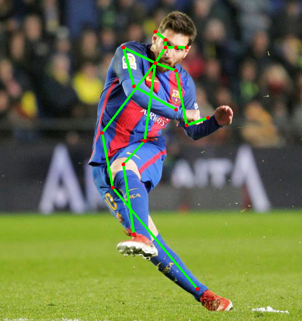

# OpenPose trained on COCO Pose dataset



> Single pose human estimation.

<p align="left">
  <a href="https://github.com/iitzco/deepzoo/releases/download/model-upload-6/openpose_pose_coco.zip">
    
  </a>
</p>

## Requirements

Run `pip install -r requirements.txt`

This will install `opencv` and `numpy`, it's only dependencies.

## How to run

You'll need to use the file `detector.py`.

```python
import cv2
import numpy as np
import sys
import random

from detector import BODY_PARTS, POSE_PAIRS, PoseDetector

PROTO = "/path/to/downloaded/prototxt/file"
MODEL = "/path/to/downloaded/caffemodel/file"

detector = PoseDetector(PROTO, MODEL)

img_path = "/path/to/image"
img = cv2.imread(img_path)

# The run method receives a numpy array with values [0-255] representing the image in [H, W, 3] shape
# `points` is a list of (x,y) representing all body parts.
points = detector.run(img)


for partFrom, partTo in POSE_PAIRS:
    idFrom = BODY_PARTS[partFrom]
    idTo = BODY_PARTS[partTo]

    if points[idFrom] and points[idTo]:
        cv2.line(img, points[idFrom], points[idTo], (0, 255, 0), 3)
        cv2.ellipse(img, points[idFrom], (3, 3), 0, 0, 360, (0, 0, 255), cv2.FILLED)
        cv2.ellipse(img, points[idTo], (3, 3), 0, 0, 360, (0, 0, 255), cv2.FILLED)

cv2.imshow('image',img)
cv2.waitKey(0)
cv2.destroyAllWindows()
```

The above script will show the annotated image.

## Customize

Deal with the returning `points` object to do whatever you want!

## Model info

* Using OpenPose official models from [here](https://github.com/CMU-Perceptual-Computing-Lab/openpose/blob/master/models/getModels.sh)

## Comment

We are using openCV's amazing `dnn` library that allows us to load Tensorflow, Caffe and Torch models. You can go [here](https://github.com/iitzco/OpenCV-dnn-samples) for more information.
